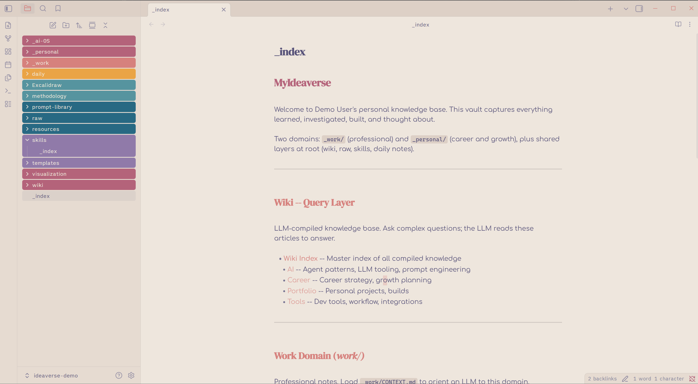
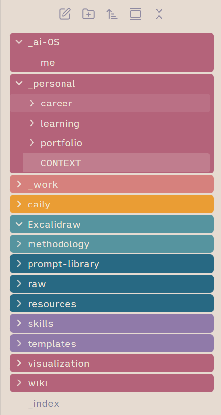
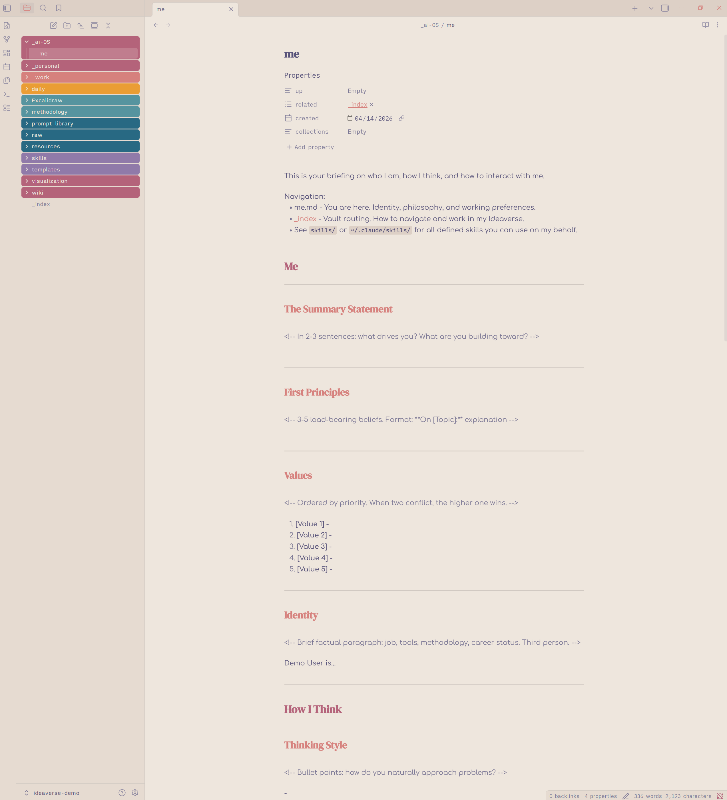
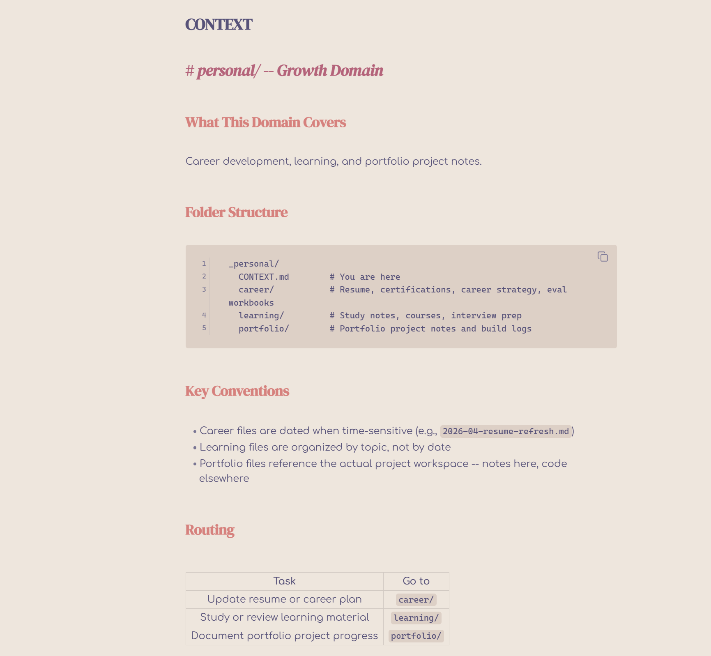

# Ideaverse Setup

Bootstrap an LLM-ready Obsidian vault with structured routing, identity dossier, and daily workflow -- in 10 minutes.

<!-- Screenshots: vault homepage, me.md identity file, folder structure -->
<p align="center">
  
</p>

**The problem:** Every new Obsidian vault starts as an empty folder. You spend hours configuring themes, installing plugins, creating folder structures, and figuring out how to make AI tools understand your vault. Then you do it again on your next machine.

**The solution:** A single command (or Claude skill) that scaffolds a complete vault with:
- ICM routing files (`_index.md`, `CONTEXT.md`) so any LLM can navigate your vault instantly
- A canonical identity file (`me.md`) that tells AI tools who you are, how you think, and how to work with you
- A curated theme + font stack that's readable and visually distinct
- 11 community plugins pre-configured for knowledge management
- A daily note workflow organized by date folders

## Two Paths

### Path 1: Python CLI (no AI required)

```bash
# Clone and install
git clone https://github.com/ktncodes/ideaverse-setup.git
cd ideaverse-setup
pip install -e .

# Scaffold a vault
ideaverse-setup ~/Documents/MyIdeaverse/Vault --user "Your Name"

# Without font installation
ideaverse-setup ~/Documents/MyIdeaverse/Vault --user "Your Name" --no-fonts
```

Then fill in `_ai-OS/me.md` using the [interview guide](docs/interview-guide.md).

### Path 2: Claude Code Skill (AI-assisted)

```bash
# Copy the skill to your Claude skills directory
cp -r SKILLS/ideaverse-setup ~/.claude/skills/ideaverse-setup
```

Then in any Claude Code session:
```
/ideaverse-setup ~/Documents/MyIdeaverse/Vault
```

The skill walks you through everything interactively, including a 3-round identity interview that compiles your answers into me.md automatically.

## What You Get

<p align="center">
  
</p>

```
YourVault/
├── _index.md                 # LLM routing -- vault homepage
├── _ai-OS/
│   └── me.md                 # Identity dossier (who you are, how to work with you)
├── _work/                    # Professional domain
│   ├── CONTEXT.md
│   ├── bugs/
│   ├── features/
│   ├── product/
│   └── reference/
├── _personal/                # Growth domain
│   ├── CONTEXT.md
│   ├── career/
│   ├── learning/
│   └── portfolio/
├── wiki/                     # LLM-compiled knowledge base
│   ├── _index.md
│   ├── ai/
│   ├── career/
│   ├── portfolio/
│   └── tools/
├── raw/                      # Ingestion queue
│   ├── _index.md
│   ├── web-clips/
│   ├── youtube/
│   └── papers/
├── daily/                    # Date-folder daily notes
│   └── _index.md
├── skills/                   # Claude skill vault backups
│   └── _index.md
├── methodology/
├── prompt-library/
├── templates/
│   └── daily-note-template.md
├── resources/
├── visualization/
├── Excalidraw/
└── .obsidian/
    ├── appearance.json       # AnuPpuccin + font config
    ├── community-plugins.json
    └── snippets/
        └── heading-font.css  # DM Serif Display headings
```

## The Identity File (me.md)

The most important file in the vault. It answers three questions for every AI tool:

<p align="center">
  
</p>

1. **Who are you?** -- Summary statement, first principles, values, identity
2. **How do you think?** -- Thinking style, problem-solving process, intellectual influences
3. **How should I work with you?** -- Communication preferences, vibe, rules, conventions

The CLI creates a skeleton. The Claude skill runs a live interview and compiles your answers. Either way, the result is a single file that any AI tool can read to personalize its behavior.

See [docs/interview-guide.md](docs/interview-guide.md) for the full question set.

## Theme & Font Stack

<p align="center">
  
</p>

| Role | Font | Why |
|------|------|-----|
| Body text | Comfortaa | Rounded geometric sans-serif. Clean, readable for long notes |
| Interface | iA Writer Quattro S | Proportional monospace hybrid. Compact sidebar, readable tabs |
| Headings | DM Serif Display | High-contrast serif. Clear visual hierarchy |
| Theme | AnuPpuccin (Moonstone) | Highly configurable Obsidian theme with light base |

See [docs/font-guide.md](docs/font-guide.md) for alternatives and troubleshooting.

## Community Plugins

| Plugin | Purpose |
|--------|---------|
| Dataview | Query vault data, power homepage heatmap |
| Calendar | Navigate daily notes by date |
| Heatmap Calendar | GitHub-style activity visualization |
| Homepage | Set `_index.md` as vault landing page |
| Style Settings | Fine-tune AnuPpuccin theme |
| Obsidian Git | Auto-backup to Git |
| QuickAdd | Macro commands for note creation |
| Excalidraw | Whiteboard diagrams |
| Iconic | Custom folder/file icons |
| Meta Bind | Interactive YAML inputs |
| Pexels Banner | Header images from Pexels |

See [docs/plugin-guide.md](docs/plugin-guide.md) for configuration tips.

## The Routing Pattern (ICM)

Every folder that an LLM might navigate has an `_index.md` or `CONTEXT.md` file that answers:
- What is this folder?
- What's in it?
- Where should I go next?

This is the [Interpretable Context Methodology](https://github.com/ktncodes/icm-template) -- a plain-text routing pattern that gives any LLM instant spatial awareness without vector databases or embeddings. The vault loads in ~2,000 tokens instead of requiring full-vault indexing.

## Requirements

- Python 3.10+
- Obsidian (for using the vault)
- Internet connection (for font download)
- Admin rights (for system font installation on Windows)

## License

MIT -- see [LICENSE](LICENSE).

## Related Projects

- [ICM Template](https://github.com/ktncodes/icm-template) -- The routing methodology this vault uses
- [Pipeline Template](https://github.com/ktncodes/pipeline-template) -- 4-phase dev workflow (/plan /scope /build /qa)
